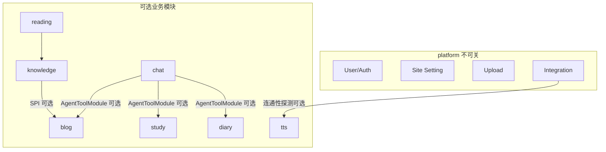

# 模块解耦设计清单

> 所属项目：Ai-Backend  
> 目标：**关闭或移除某个业务模块后，应用仍能正常启动与运行**（核心平台能力不受影响）。  
> 策略：**单体可插拔**（Feature Flag + 条件装配 + SPI），不急于 Maven 多模块拆分。

---

## 1. 目标与非目标

### 1.1 目标

| 项 | 说明 |
| --- | --- |
| 运行时关模块 | 通过 `app.modules.*=false` 关闭 Blog / Study / TTS 等，进程正常启动 |
| API 可预期 | 关闭模块的接口返回 **404 或统一业务码**（文档约定一种），不 NPE |
| 跨模块可选集成 | Knowledge 发博客、Chat Agent 调业务工具等，依赖 **SPI + 可选实现** |
| 配置隔离 | 模块专属 YAML 段在关闭时可缺省，不触发 Bean 创建失败 |
| 可渐进落地 | 分阶段改造，每阶段可独立验收 |

### 1.2 非目标（本期不做）

- 拆成多个可独立部署的微服务
- Maven 多模块 + 独立发版（留作 Phase 4 备选）
- 删掉源码目录后零改动仍能编译（「关开关」优先于「删代码」）
- 前端按模块拆仓库（仅约定菜单/路由随模块能力隐藏）

---

## 2. 模块划分

```text
platform（不可关）
  ├── user / auth / security
  ├── site-setting（SettingModuleRegistry）
  ├── upload / image
  ├── integration（密钥、连通性探测）
  └── common（异常、分页、ResultUtils）

ops（可关，建议默认开）
  ├── ai-usage / ops-audit / biz-stats / http-log

blog（可关）
knowledge（可关，含 RAG / 文档 / 向量 / 对话）
reading（可关，精读合蒸；可与 knowledge 同开关或子开关）
chat（可关，含 agent / segmentation / image-caption）
study（可关）
diary（可关）
tts（可关）
app-lab（可关，AI 实验室 / 代码部署）
```

**依赖关系（允许的方向）**



原则：**业务模块只依赖 platform；业务之间只通过 SPI / 事件，不直接 `@Resource` 对方 Service**。

---

## 3. 现状耦合清单（改造前）

| # | 耦合点 | 位置 | 风险 | 处理 |
| --- | --- | --- | --- | --- |
| C1 | Knowledge 直接依赖 Blog | `KnowledgeNotePublishServiceImpl`、`KnowledgeNoteServiceImpl` → `BlogPostService` | 关 blog 后 knowledge Bean 仍强依赖 | ✅ P2 `NoteBlogPublisher` SPI |
| C2 | Chat Agent 聚合全量工具 | `AgentToolRegistry` 注入所有 `AgentToolModule` | 关 study/diary/blog 仍加载工具 Bean | ✅ P1 工具模块 `@ConditionalOnModule({"chat", …})` |
| C3 | 全局 Mapper 扫描 | `AiApplication` `@MapperScan("com.ai.mapper")` | 关模块后 Mapper 仍注册 | ✅ P3 Mapper 下沉 + `ModuleMapperConfiguration` |
| C4 | 全局调度 | `@EnableScheduling` + `KnowledgeReadingJobWorker` | 关 reading 仍抢任务 | ✅ P1 Worker `@ConditionalOnModule("reading")` |
| C5 | 启动 Runner | `TtsWarmupRunner` | 关 tts 仍尝试预热 | ✅ P1 `@ConditionalOnModule("tts")` |
| C6 | 设置模块无运行时开关 | `SettingModule` 仅 schema，Bean 始终存在 | 设置页展示已关模块 | ✅ P1 各 `*Module` 条件化 |
| C7 | 条件装配覆盖不足 | 仅 `chat.agent`、`chat.image-caption`、`app.redis` 等少量 | 大部分 Controller/Service 无条件注解 | ✅ P1 全域 Controller/Service 条件化 |
| C8 | Integration 探测 TTS | `IntegrationConnectivityServiceImpl` → `TtsProxyService` | 关 tts 仍注入 TTS 客户端 | ✅ P1 `ObjectProvider`（含向量/AstrBot） |
| C9 | Ops 横切注入 | 各 Service → `OpsAuditLogService` | 关 ops 需 no-op 实现 | ✅ P1 4 个 `@Primary` NoOp |
| C10 | Study 直接依赖 Blog | `StudyTaskServiceImpl` → `BlogPostMapper`（同步博客草稿） | 关 blog 后 study 启动失败 | ✅ P3 `BlogDraftReader` SPI |

### 跨模块依赖审计结论（Phase 3 收尾）

对 `BlogPostService` / `knowledge.*` / `Tts*` / `Study*` / `Chat*` / `Diary*` 等模块服务的注入方做了全量排查：

- 业务模块之间已无「非本模块、未经 SPI/ObjectProvider」的强注入（C1/C10 已消除）。
- 唯一的平台级跨模块注入点 `IntegrationConnectivityServiceImpl` 已用 `ObjectProvider` 守卫。
- Agent 工具（blog/study/diary）均 `chat` + 对应模块双开才注册。
- Ops 横切依赖由 NoOp 兜底。

→ 结论：**当前可安全摘除任一业务模块而不致启动失败**；剩余仅 controller/service/entity 的 `com.ai.module.*` 物理迁移（纯组织性，暂缓）。

---

## 4. 技术方案

### 4.1 模块开关（Phase 1 核心）

**配置契约**（`application.yml`）：

```yaml
app:
  modules:
    ops: true
    blog: true
    knowledge: true
    reading: true      # false 时关闭精读 Job + reading 设置子域
    chat: true
    study: true
    diary: true
    tts: true
    app-lab: true
```

**自定义注解**（建议新增）：

```java
@ConditionalOnModule("blog")
@Target({ElementType.TYPE, ElementType.METHOD})
@Retention(RetentionPolicy.RUNTIME)
public @interface ConditionalOnModule {
    String value();
    boolean matchIfMissing() default true;
}
```

实现：`OnModuleCondition` 读取 `app.modules.<name>`，与 `@ConditionalOnProperty` 等价但语义统一。

**需加 `@ConditionalOnModule` 的类型**

- [ ] 各域 `*Controller`
- [ ] 各域 `*Service` / `*ServiceImpl`
- [ ] 各域 `mapper` 包下接口（或模块级 `@Configuration` + 局部 `@MapperScan`）
- [ ] `setting/module/*Module`（关模块则从 Registry 排除）
- [ ] `agent/tools/*AgentToolModule`
- [ ] `job/*Worker`、`config/*Runner`（如 `TtsWarmupRunner`、`KnowledgeReadingJobWorker`）
- [ ] 模块专属 `@ConfigurationProperties` 绑定类（可选：关模块不绑定）

**platform 常驻**：`UserController`、`AdminSiteSettingsController`（壳）、`Security`、`Upload`、`Integration`。

### 4.2 跨模块 SPI（Phase 2）

| SPI 接口 | 定义方 | 默认实现 | 真实实现 |
| --- | --- | --- | --- |
| `NoteBlogPublisher` | `knowledge.spi` | `NoOpNoteBlogPublisher` | `BlogNoteBlogPublisher`（`blog` 开） |
| `NoteBlogSyncer` | `knowledge.spi` | no-op | blog 开时注册 |
| `OpsAuditReporter` | `platform.spi` 或 `ops.spi` | `NoOpOpsAuditReporter` | `DefaultOpsAuditReporter` |
| `ModuleCapabilityProvider` | `platform` | 汇总各模块是否启用 | 供前端 `/app/capabilities` |

**Knowledge 发博客改造要点**

- [ ] `KnowledgeNotePublishService` 只依赖 `NoteBlogPublisher`
- [ ] `KnowledgeNoteServiceImpl` 查关联博客：通过 `Optional<NoteBlogQuery>` 或 VO 层组装，不在 knowledge 内直接调 `BlogPostService`
- [ ] `publish-blog` / `sync-blog`：blog 关时返回明确错误码 `MODULE_DISABLED`

**Chat Agent 工具**

- [ ] 各 `*AgentToolModule` 整类 `@ConditionalOnModule`
- [ ] `AgentToolRegistry` 保持 `List<AgentToolModule>` 注入（Spring 只注册已启用模块）

**Integration 连通性**

- [ ] `TtsProxyService` 探测改为 `ObjectProvider<TtsProxyService>` 或 `@Autowired(required = false)`
- [ ] TTS 关时跳过探测项，不报失败

### 4.3 包结构（Phase 3，渐进迁移）

不强制一次搬完；新代码按纵向切片，旧代码迁移时打勾。

```text
com.ai
├── platform/          # 原 common、user、setting、security、upload
│   ├── auth/
│   ├── setting/
│   └── web/
├── module/
│   ├── blog/
│   │   ├── controller/
│   │   ├── service/
│   │   ├── mapper/
│   │   └── BlogModuleConfiguration.java   # @MapperScan + @ConditionalOnModule
│   ├── knowledge/
│   ├── reading/
│   ├── chat/
│   ├── study/
│   ├── diary/
│   ├── tts/
│   └── ops/
└── AiApplication.java   # 仅 @SpringBootApplication，MapperScan 下沉到各 ModuleConfiguration
```

- [x] Mapper 下沉：Mapper 按模块拆到 `com.ai.mapper.<module>`（blog/chat/study/diary/tts/ops/app/knowledge），platform 为 `com.ai.mapper.platform`
- [x] `com.ai.config.mapper.ModuleMapperConfiguration`：platform 常驻 + 各模块 `@ConditionalOnModule` + `@MapperScan`
- [x] `AiApplication` 去掉全局 `@MapperScan`
- [ ] （未做）controller/service/entity 物理迁到 `com.ai.module.*` / `com.ai.platform.*`（纯组织性，成本高，暂缓）
- [ ] 跨包只允许 `platform` 与 `module.xxx.spi` 对外类型

### 4.4 API 与前端契约（Phase 1 同步）

- [x] 新增 `GET /api/app/modules` 或扩展现有 App 接口：返回各模块 `enabled`
- [x] 关模块路由：统一 **404**（Spring 不注册 Controller）
- [x] 设置中心：`SettingModuleRegistry.all()` 过滤 `app.modules`（各 `*Module` Bean 条件化后自动生效）
- [x] 契约与前端对接说明就绪（待前端实现）：见 [01-frontend-integration.md](01-frontend-integration.md) —— 菜单/路由按 capabilities 隐藏、跨模块按钮条件显示、404 兜底、异步任务轮询

### 4.5 数据库与 SQL（运维清单）

关模块 **不删表**；仅不访问。可选提供 `sql/optional/` 说明哪些表属于哪模块。

| 模块 | 主要表（示例） |
| --- | --- |
| blog | `blog_post`, `blog_category`, `blog_tag`, … |
| knowledge | `knowledge_*`, `source_document`, … |
| reading | `knowledge_reading_job` |
| study | `study_*` |
| diary | `diary_entry` |
| tts | `tts_voice_profile` |
| chat | `chat_conversation`, `chat_message`, … |

- [x] 文档注明：关模块后相关 API 不可用，表可保留 —— 见 `src/main/resources/sql/README-modules.md`
- [x] 新环境最小集：仅 platform + 你启用的模块执行对应 schema —— 同上文档给出映射与最小安装集示例

---

## 5. 分阶段实施清单

### Phase 0：基线（0.5 天）

- [ ] 本文档评审通过，确定模块枚举与配置 key
- [ ] 记录「默认全开」的 `application.yml` 片段
- [ ] 补充启动验收脚本思路：`-Dapp.modules.blog=false` 等

### Phase 1：开关 + 条件装配（2～3 天）

**基础设施**

- [x] 新增 `AppModuleProperties`（`app.modules`）
- [x] 新增 `@ConditionalOnModule` + `OnModuleCondition`
- [x] 新增 `GET /api/app/modules`（`ModuleCapabilitiesController`）

**按模块打开关**

| 模块 | Controller | Service | SettingModule | Job/Runner | 状态 |
| --- | --- | --- | --- | --- | --- |
| blog | Blog*Controller | Blog*Service | BlogModule | — | ☐ |
| knowledge | Knowledge*Controller | knowledge/* | KnowledgeModule | — | ☐ |
| reading | （合在 KnowledgeAdmin） | ReadingJob* | ReadingModule | KnowledgeReadingJobWorker | ☐ |
| chat | Chat*Controller | Chat* / agent/* | ChatModule | — | ☐ |
| study | Study*Controller | Study* | StudyModule | — | ☐ |
| diary | Diary*Controller | Diary* | DiaryModule | — | ☐ |
| tts | TtsController | Tts* | TtsModule | TtsWarmupRunner | ☐ |
| ops | AdminOpsController | Ops* / BizStat* | OpsModule | — | ☐ |
| app-lab | AppController（部分） | AppService | AppModule | — | ☐ |

**验收**

- [ ] `app.modules.tts=false` 启动成功，无 TTS 相关 Bean
- [ ] `app.modules.study=false` 启动成功，`/admin/study/**` 404
- [ ] 默认全开时行为与改造前一致（回归 smoke）

### Phase 2：SPI 解耦（2～3 天）

- [x] 定义 `NoteBlogPublisher`（`com.ai.service.knowledge.spi`）+ `NoOpNoteBlogPublisher`（blog 关兜底）+ `BlogNoteBlogPublisher`（`com.ai.service.blog`，`@ConditionalOnModule("blog")`）
- [x] 改造 `KnowledgeNotePublishServiceImpl`、`KnowledgeNoteServiceImpl`：改用 `NoteBlogPublisher`，knowledge 不再 import `BlogPostService` / blog DTO
- [x] `OpsAuditLogService` 采用 Phase 1 的 4 个 `@Primary` NoOp 实现（对应「或 `ObjectProvider`」备选），`ops=false` 时静默丢弃
- [x] `IntegrationConnectivityServiceImpl` 弱依赖 TTS / 向量 / AstrBot（Phase 1 `ObjectProvider` 已完成）
- [x] Agent 工具模块条件化（Phase 1 已做：blog/study/diary 工具需 `chat` + 对应模块双开）

**验收**

- [x] `knowledge=true, blog=false`：精读 CRUD 正常；`publish-blog`/`sync-blog` 通过 `requireBlogAvailable()` 快速失败并返回「博客模块未启用」
- [x] `chat=true, study=false, diary=false`：Agent 仅注册 blog 工具（若 blog 开）
- [x] `ops=false`：业务写操作不报错，审计静默丢弃

### Phase 3：包迁移与 Mapper 下沉（按需，3～5 天）

已落地「Mapper 下沉」子集（不含 controller/service/entity 物理迁移）：

- [x] Mapper 按模块下沉到 `com.ai.mapper.<module>` + 同步 18 个 XML `namespace`
- [x] `ModuleMapperConfiguration`（platform 常驻 + 各模块 `@ConditionalOnModule` + `@MapperScan`）
- [x] `AiApplication` 移除全局 `@MapperScan`
- [x] 解耦 study→blog：`StudyTaskServiceImpl` 通过 `BlogDraftReader` SPI（`NoOpBlogDraftReader` / `BlogDraftReaderImpl`）读取博客草稿，不再注入 `BlogPostMapper`
- [ ] （暂缓）迁移 blog / 其余模块整包到 `com.ai.module.*`

**验收**

- [x] `mvn -DskipTests compile` 通过；无残留 `com.ai.mapper.<Flat>` 引用
- [x] 关模块后其 Mapper 不再被扫描（依赖 `@ConditionalOnModule`，与服务同机制）
- [ ] （运行期）在 DB/Redis 环境启动，确认默认全开时 Mapper 绑定正常；`app.modules.blog=false` 时 study「同步博客草稿」报「博客模块未启用」
- [ ] （暂缓）包结构完全符合 4.3；模块间无「错误方向」import

### Phase 4：Maven 多模块（备选，非必须）

仅在需要独立 artifact 或团队分工时启动：

- [ ] `ai-platform`、`ai-module-blog`、`ai-app` 父 POM
- [ ] `ai-app` 通过 Maven optional/profile 组装模块

---

## 6. 模块级详细检查表

### 6.1 Blog

- [ ] 所有 `Blog*Controller` / `Blog*Service` 加 `@ConditionalOnModule("blog")`
- [x] 不被 knowledge **强依赖**（仅 SPI 实现 `BlogNoteBlogPublisher` 依赖 blog）
- [ ] Agent：`BlogAgentToolModule` 条件化

### 6.2 Knowledge + Reading

- [ ] Knowledge 域 Controller/Service 条件化
- [ ] Reading：`KnowledgeReadingJobWorker` + `KnowledgeReadingJobService` 可用子开关 `reading` 或随 knowledge
- [ ] MinIO / 向量 / RAG 配置：关 knowledge 时不创建 `KnowledgeVectorStoreService` 等
- [x] 发博客走 `NoteBlogPublisher`

### 6.3 Chat

- [ ] `ChatController`、`ChatAgent*`、`ChatImageCaption*` 条件化
- [ ] 已有 `@ConditionalOnProperty` 的与 `@ConditionalOnModule("chat")` 组合（chat 关则整域关）
- [ ] Redis 聊天记忆保持独立开关 `app.redis.available`

### 6.4 Study / Diary

- [ ] 独立开关，无跨模块 Service 依赖（除 Agent 工具）
- [ ] `StudyRedisCacheService` 随 study 关

### 6.5 TTS

- [ ] `TtsController`、`Tts*Service`、`TtsWarmupRunner`、`GptSovits*` 配置条件化
- [ ] Integration 探测可选

### 6.6 Ops

- [ ] 关时注册 `NoOpOpsAuditReporter`、`NoOpAiUsageLogger` 等
- [ ] `AdminOpsController` 条件化或返回空数据（推荐条件化）

### 6.7 Platform

- [ ] User / Site Settings / Upload / Integration **始终启用**
- [ ] `MaintenanceModeInterceptor` 常驻
- [ ] `SettingModuleRegistry` 过滤已关模块

---

## 7. 测试与验收矩阵

| 场景 | 配置 | 预期 |
| --- | --- | --- |
| 默认 | 全 `true` | 与现网一致 |
| 最小后台 | 仅 platform + user | 启动成功，业务 API 404 |
| 无博客精读 | `knowledge=true, blog=false` | 精读可用，发布博客明确失败 |
| 无学习 | `study=false, chat=true` | 学习 API 404，聊天正常 |
| 无 TTS | `tts=false` | 无预热日志，TTS API 404 |
| 无精读任务 | `reading=false` | 无 Worker 日志，batch-url 行为见产品约定* |

\* `reading=false` 时二选一（实施前定案）：  
A) 整个 batch-url 不可用；  
B) `sync_mode=sync` 仍可用，仅关闭异步队列。推荐 **B**（精读能力归 knowledge，reading 只关 Job）。

---

## 8. 风险与对策

| 风险 | 对策 |
| --- | --- |
| 漏加条件注解导致关模块仍创建 Bean | 启动后 Actuator `beans` 或单元测试断言 Bean 不存在 |
| SPI 默认实现遗漏 | 所有 SPI 必须有 `@Primary` no-op |
| 前端仍调已关 API | capabilities 接口 + 菜单隐藏 |
| 关 knowledge 后 reading 语义不清 | reading 作为 knowledge 子能力，不单独关 API |
| 改造范围过大 | 严格按 Phase 1→2，每阶段可发布 |

---

## 9. 实施顺序建议（给执行人）

1. **Phase 0**：评审本文档，锁定 `reading` 子开关策略（§7 脚注）  
2. **Phase 1**：`AppModuleProperties` + `@ConditionalOnModule` + TTS/Study 试点验收  
3. **Phase 1**：铺开其余 Controller/Service/Job/SettingModule  
4. **Phase 2**：Knowledge ↔ Blog SPI  
5. **Phase 2**：Ops no-op + Integration 弱依赖  
6. **Phase 3+**：包迁移与 Mapper 下沉（有空再做）  

---

## 10. 参考代码位置

| 能力 | 路径 |
| --- | --- |
| 应用入口 | `com.ai.AiApplication` |
| 设置模块注册 | `com.ai.setting.SettingModuleRegistry` |
| Agent 工具注册 | `com.ai.agent.registry.AgentToolRegistry` |
| 已有条件装配示例 | `com.ai.agent.config.AgentChatModelConfig`、`com.ai.config.ChatImageCaptionConfig` |
| Knowledge→Blog 耦合 | `KnowledgeNotePublishServiceImpl`、`KnowledgeNoteServiceImpl` |
| 异步精读 Worker | `com.ai.job.KnowledgeReadingJobWorker` |
| TTS 启动预热 | `com.ai.config.TtsWarmupRunner` |

---

## 11. 变更记录

| 日期 | 说明 |
| --- | --- |
| 2026-07-17 | 初稿：单体可插拔方案与分阶段清单 |
